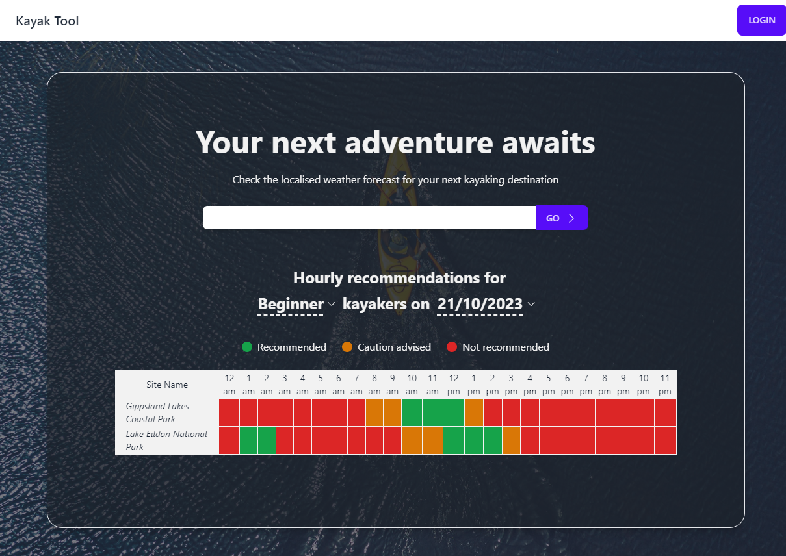

# kayak-weather-tool
Web app for kayak hobbyist to check for weather forecast to plan their kayaking trip. Built with React, TailwindCSS, Vite, DaisyUI. 

Made proudly by volunteers from [The Break Inc](https://thebreak.org.au/)

The app is currently in the prototyping stage and is planned for production within Q1 2024. The link will be available in this README once put into production.

Recommendations and suggestions are welcomed! Please do so via the "Issues" tab in this repo.

# Landing page showcase:
---

